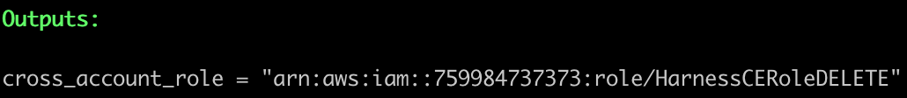

# Terraform AWS Harness CCM

Terraform to configure the CCM module for AWS on Harness.

Can be used as an example or a module:

```terraform
module "ccm" {
  source              = "github.com/rssnyder/terraform-aws-harness-ccm.git"
  external_id         = "harness:891928451355:XXXXXXXXXXXXXXX"
  enable_events       = true
  enable_optimization = true
}
```

## how-to

Log in to [harness](app.harness.io) and navigate to the `Cloud Costs` service. Select `AWS`.


Name the connector, and enter your AWS account ID.


Enter the name of the usage report and s3 bucket. The defaults in this terraform example are `harness-ccm` and `harness-ccm`. If you are using the prefix variable, add the prefix in front of the default values. Do not create these resources, they will be created by Terraform.


You can enable the CCM features you want on this screen (but the features will also be enabled optionally in the terraform example).


Copy the `External ID` from the next page, you will need it as an input to the terraform.


Copy the code locally, [install terraform](https://learn.hashicorp.com/tutorials/terraform/install-cli), set up your AWS credentils, and optionally enable or disable any of the CCM features by editing the `variables.tf` file. If you are using a prefix, make sure the value matches the prefix you specified previously.


Now run a `terraform init`, `terraform apply`, and enter the `External ID` when prompted.


When complete the terraform will output an `Cross Account Role ARN`



Paste the role arn into the AWS Connector wizard and continue.


The next screen will verify you have set up the AWS Connector correctly.


To enable features in the future, you can simply change the input varibles and rerun the terraform.

## Resources

| Name | Type |
|------|------|
| aws_s3_bucket.harness_ccm | Resource |
| aws_s3_bucket_acl.harness_ccm | Resource |
| aws_s3_bucket_server_side_encryption_configuration.harness_ccm | Resource |
| aws_s3_bucket_public_access_block.harness_ccm | Resource |
| aws_s3_bucket_policy.harness_ccm | Resource |
| aws_cur_report_definition.harness_ccm | Resource |
| aws_iam_role.harness_ce | Resource |
| aws_iam_policy.harness_getrole | Resource |
| aws_iam_role_policy_attachment.harness_ce_getrole | Resource |
| aws_iam_policy.harness_eventsmonitoring | Resource |
| aws_iam_role_policy_attachment.harness_ce_eventsmonitoring | Resource |
| aws_iam_policy.harness_billingmonitoring | Resource |
| aws_iam_role_policy_attachment.harness_ce_billingmonitoring | Resource |
| aws_iam_role.harness_ce_lambda | Resource |
| aws_iam_policy.harness_optimsationlambda | Resource |
| aws_iam_role_policy_attachment.harness_ce_lambda_eventsmonitoring | Resource |
| aws_iam_policy.harness_optimsation | Resource |
| aws_iam_role_policy_attachment.harness_ce_optimsation | Resource |
| aws_iam_policy.harness_governance | Resource |
| aws_iam_role_policy_attachment.harness_governance | Resource |
| aws_caller_identity.current | Data Source |
| aws_iam_policy_document.harness_ccm | Data Source |
| aws_iam_policy_document.harness_ce | Data Source |
| aws_iam_policy_document.harness_getrole | Data Source |
| aws_iam_policy_document.harness_eventsmonitoring | Data Source |
| aws_iam_policy_document.harness_billingmonitoring | Data Source |
| aws_iam_policy_document.harness_ce_lambda | Data Source |
| aws_iam_policy_document.harness_optimsationlambda | Data Source |
| aws_iam_policy_document.harness_optimsation | Data Source |
| aws_iam_policy_document.harness_governance | Data Source |

## Inputs

| Name | Description | Type | Default | Required |
|------|-------------|------|---------|:--------:|
| [external_id](https://docs.aws.amazon.com/IAM/latest/UserGuide/id_roles_create_for-user_externalid.html) | The external id given by harness | `string` | | yes |
| enable_billing | Enable AWS Cost Visibility | `bool` | true | no |
| enable_events | Enable AWS Resource Management | `bool` | false | no |
| enable_optimization | Enable AWS Optimization by Auto-Stopping | `bool` | false | no |
| enable_governance | Enable AWS Asset Governance | `bool` | false | no |
| prefix | A string to add to all resources to add uniqueness | `string` | | no |
| additional_external_ids | Additional external ids to allow | `list(string)` | | no |

## Outputs

| Name | Description |
|------|-------------|
| cross_account_role | The role created in AWS that gives the Harness account access. |

## References

[Harness CCM AWS Setup Guide](https://docs.harness.io/article/80vbt5jv0q-set-up-cost-visibility-for-aws)

[Harness CCM CloudFormation Template](https://continuous-efficiency-prod.s3.us-east-2.amazonaws.com/setup/ngv1/HarnessAWSTemplate.yaml)
